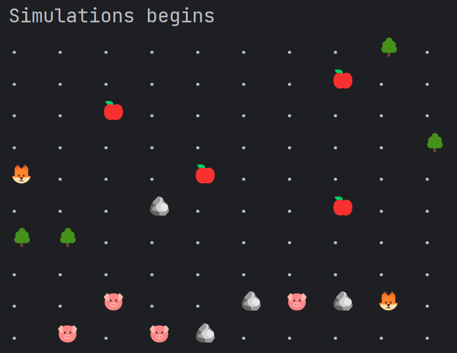
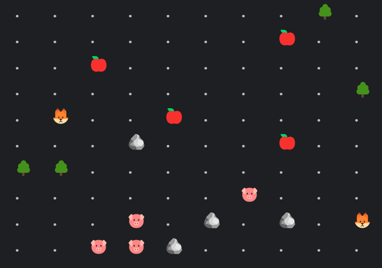
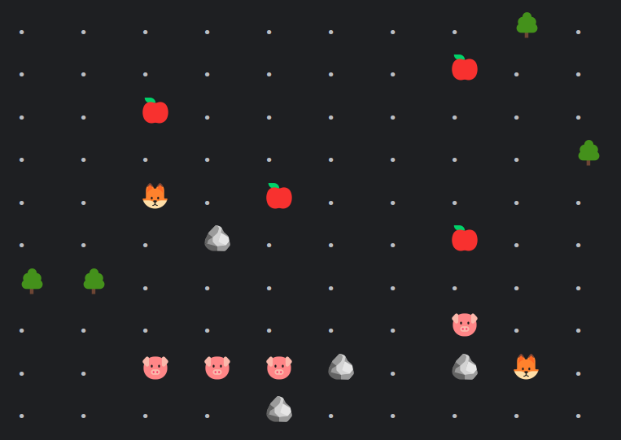
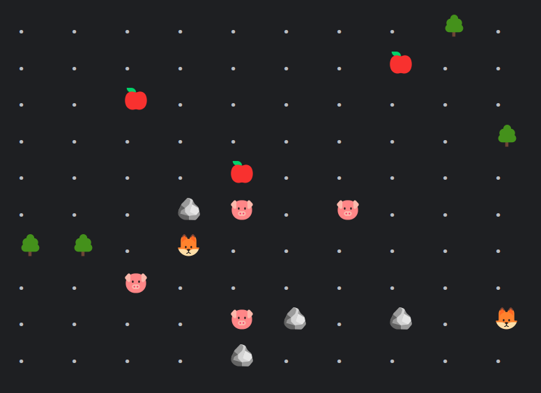
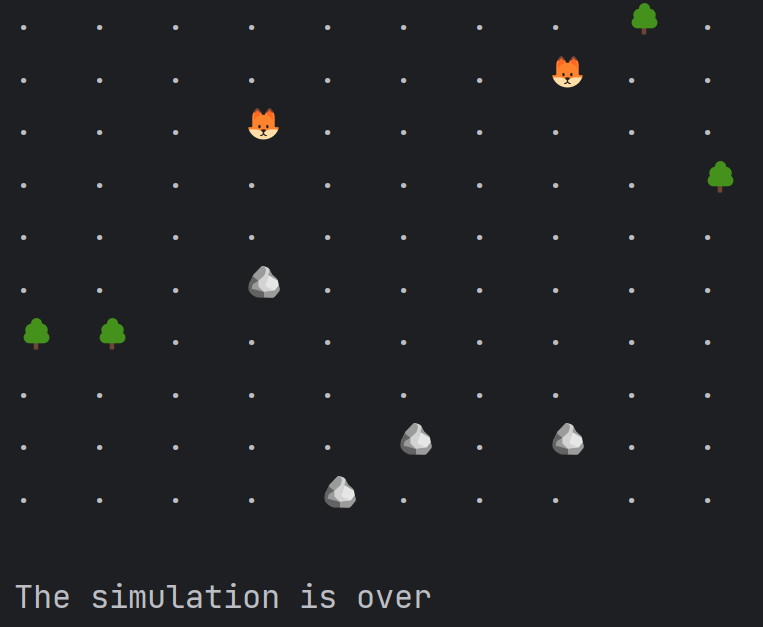

# Project «Life Simulation»

Simulation is an app that represent the world of animals and not living belings.
#### Project from practise course https://zhukovsd.github.io/java-backend-learning-course/Projects/Simulation/

##### Where there are

* pigs 🐷
* foxes 🦊
* trees 🌳
* rocks 🪨
* Pig try to find apples
* Foxes try to find pigs

---

## How to run program

#### Run the program using ClassPath

- `javac .\src\main\java\avlyakulov\timur\simulation\entity\*.java .\src\main\java\avlyakulov\timur\simulation\game\*.java -d classes`
- `java -classpath classes avlyakulov/timur/simulation/game/GameStart`

#### Run the program using jar file

- `javac .\src\main\java\avlyakulov\timur\simulation\entity\*.java .\src\main\java\avlyakulov\timur\simulation\game\*.java -d classes`
- `jar -cmf manifest.mf life-simulation.jar -C classes .`
- `java -jar .\life-simulation.jar`

---

## How program works, screenshots:

## 1 step

## 2 step

## 3 step

## 4 step

## last step

